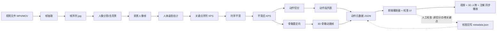
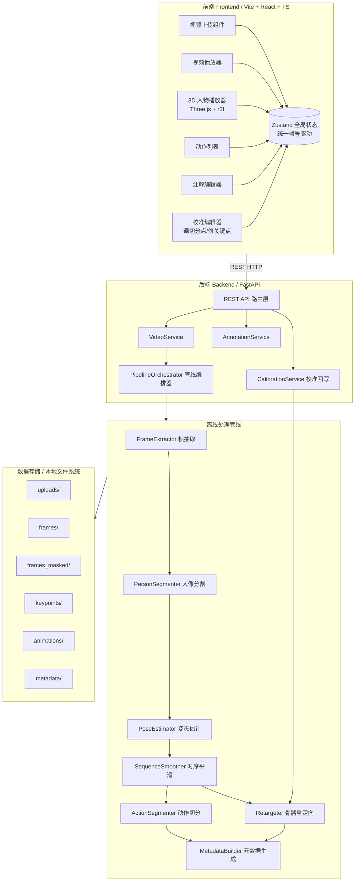
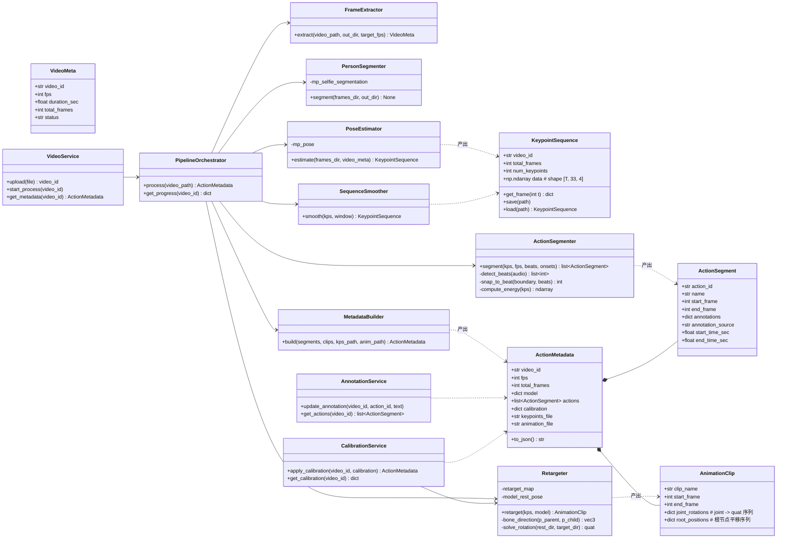
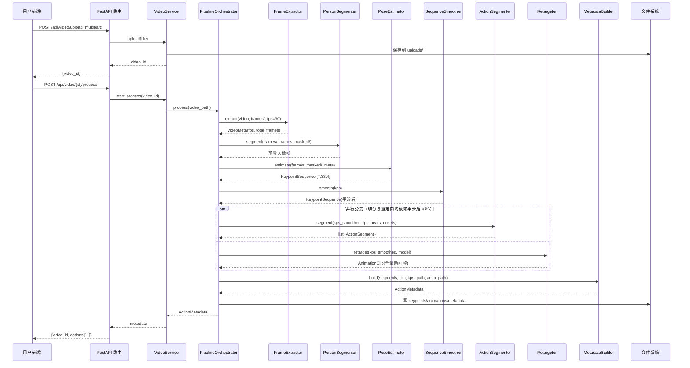
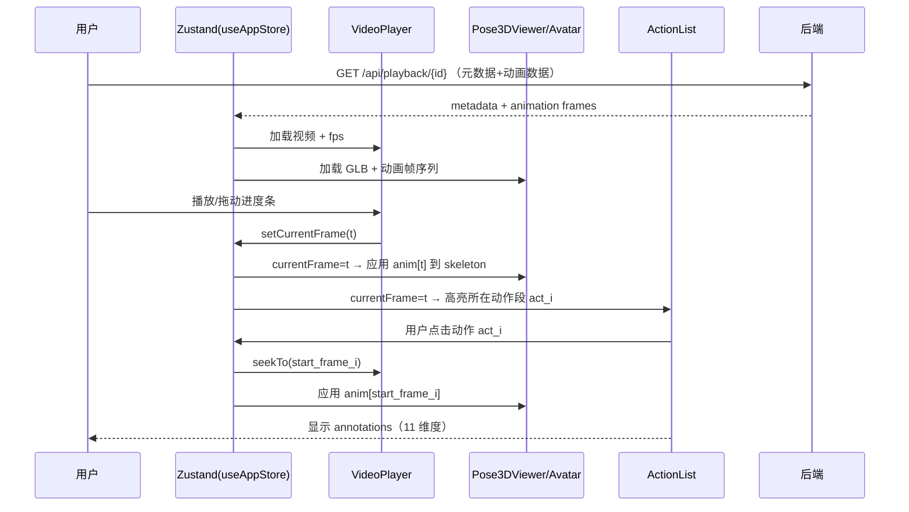
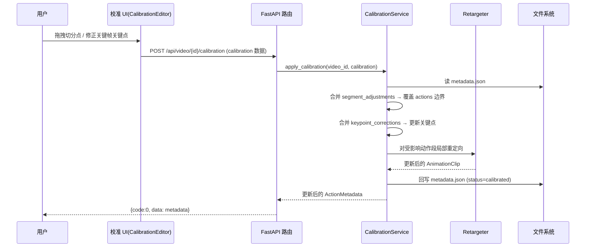
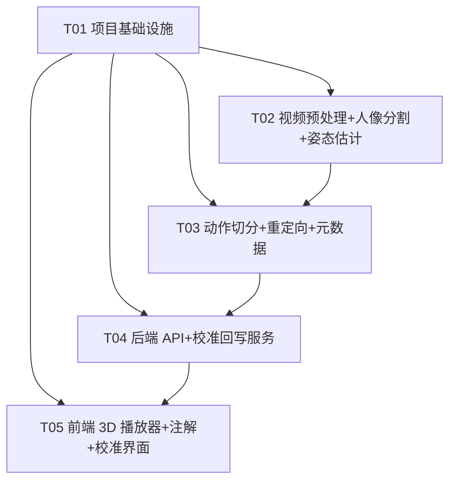

# 舞蹈动作拆解软件 — 系统架构设计

> 架构师：高见远
> 版本：v0.2（第一版 / 两周 MVP）
> 舞种定位：**K-pop 男团编舞**（参考 CORTIS / HYBE，代表作 REDRED「甩耳朵舞」、Go!）——高能量、强节拍、刀群舞（齐舞、动作利落锐利 angular）、killing point 记忆点动作
> 目标读者：主理人、产品经理、工程师

---

## 一、实现方案（Implementation Approach）

### 1.1 核心挑战

1. **视频帧 ↔ 3D 动作数据的精确对齐**：如何保证视频里的每一个动作、每一帧，都能映射到可驱动 3D 人物的动作数据上（本设计的核心技术命题，详见第二部分）。
2. **2D 视频到 3D 骨骼的深度缺失**：普通单目视频只有 2D 像素信息，缺少深度，需要姿态估计模型补出第三维。
3. **连续舞蹈如何切成"一个动作一个动作"**：动作边界检测没有唯一标准答案，需要能量/节拍/模板多策略。
4. **低资源约束**：本科学生、资源有限、两周出第一版 → 必须选开源/免费、可本地或免费额度运行的方案。

### 1.2 技术选型（结合"本科、资源有限、两周 MVP"约束）

| 环节 | 首选方案 | 备选/进阶方案 | 选型理由 |
|------|----------|----------------|----------|
| 视频帧抽取 | OpenCV + FFmpeg | — | 免费、本地、稳定，`cv2.VideoCapture` 逐帧读取 |
| 人像分割/去背景 | **MediaPipe Selfie Segmentation**（轻量、CPU 实时） | rembg（U²-Net，精度高但较慢）、YOLOv8-seg（需 onnx/torch） | 复杂背景下去背景，显著提升姿态估计准确率；与 MediaPipe 同生态、免 GPU |
| 人体姿态估计 | **MediaPipe Pose**（33 landmarks，含 3D world 坐标） | OpenPose（2D）、AlphaPose（2D 精度更高）、WHAM（SMPL 3D 参数） | 免费、CPU 可跑、**自带 3D 关键点**，无需 GPU，两周内可落地 |
| 时序平滑 | SciPy（Savitzky-Golay）/ 滑动平均 | 卡尔曼滤波 | 简单、去抖动、免费 |
| 动作切分 | **librosa 节拍/onset 检测为主**（K-pop 重拍明确）+ 关键点能量峰辅助 | 模板匹配（DTW）、时序分类模型 | K-pop 刀群舞强节拍、重拍规整，节拍是天然切分锚点；能量峰兜底无节拍片段 |
| 骨骼重定向 | 方向向量法（四元数旋转求解）+ 可选 IK 微调 | Blender Rigify、MMHuman3D、SMPL-X | 自研轻量、可控、无重型依赖；两周内可完成 |
| 3D 人物模型 | Mixamo 免费 rigged 模型（GLB，如 Y Bot） | 自建 Rigify 骨骼 | 免费、标准人形骨骼（Humanoid），可直接被 Three.js 驱动 |
| 3D 渲染/播放 | Three.js + @react-three/fiber + drei | Babylon.js | 浏览器内渲染、生态成熟、前端一体化 |
| 后端 | Python + FastAPI | Flask | 与 OpenCV/MediaPipe/librosa 生态天然契合，异步、易写 |
| 前端框架 | Vite + React + TypeScript + Zustand + **MUI + Tailwind CSS** | — | 快速开发、类型安全、状态管理轻量；MUI 组件 + Tailwind 样式（PRD 指定） |
| 数据存储 | 本地文件系统 + JSON 元数据 | SQLite（后续版本） | 第一版数据量小，JSON 即可；元数据天然可读可调试 |

### 1.3 架构模式

采用 **前后端分离 + 离线批处理管线（Pipeline）** 模式：

- **后端**：分层（API 层 → 服务层 → 管线层），管线为"串行阶段"编排，每阶段独立可替换。
- **前端**：视图 + 3D 渲染 + 轻量状态管理（Zustand），通过 REST API 与后端交互。
- **核心设计原则**：以"视频帧序号"为全系统唯一时间轴主键，所有中间产物（关键点、动画、动作段、注解）都挂载到帧序号上，从根本上保证 3D 动作与视频对齐。

---

## 二、重点专题：3D 动作数据与视频的对应关系（用户点名第四问）

### 2.1 数据管线总览



### 2.2 每一步的输入 / 输出

| 阶段 | 工具/方法 | 输入 | 输出 | 输出结构 |
|------|-----------|------|------|----------|
| ① 帧抽取 | OpenCV | 视频文件 `video.mp4` | 帧序列 + fps | `frames/f_000001.jpg ... f_NNNNNN.jpg`，`fps` |
| ② 人像分割/去背景 | MediaPipe Selfie Segmentation | 帧序列 | 前景人像帧（背景置黑/透明） | `frames_masked/f_000001.jpg ...`，帧号不变 |
| ③ 姿态估计 | MediaPipe Pose | 前景人像帧 | 每帧 33 个关键点（3D） | `kps[t] = [(x,y,z,vis) x 33]`，shape `[T, 33, 4]` |
| ④ 时序平滑 | Savitzky-Golay | 关键点序列 | 平滑后关键点 | 同上 `[T, 33, 4]` |
| ⑤ 动作切分 | 节拍为主 + 能量峰辅助 | 平滑后关键点 + 节拍/onset 序列 | 动作段列表（边界吸附节拍帧） | `[{start_frame, end_frame}, ...]`，边界 ∈ 节拍帧 |
| ⑥ 骨骼重定向 | 方向向量法 | 关键点 + 模型骨骼定义 | 3D 动画帧 | `anim[t] = {joint_rot_quats, root_pos}`，shape `[T]` |
| ⑦ 元数据生成 | JSON 组装 | 动作段 + 动画 + 注解 | 动作元数据 | `metadata.json`（见 2.4） |
| ⑧ 播放 | Three.js 前端 | 视频 + 动画 + 元数据 | 同步渲染 | 浏览器实时 |

### 2.3 对应关系的确切形式：统一时间轴模型（核心）

**唯一主键 = 视频帧序号 `t`**，全系统所有数据都通过对齐到 `t` 实现对应：

```
时间戳(秒)  =  t / fps                       （视频时间戳）
关键点帧    =  kps[t]     —— 第 t 帧的姿态    （1:1 对齐）
3D 动画帧   =  anim[t]    —— 第 t 帧的骨骼姿态（1:1 对齐，因为重定向逐帧进行）
动作段      =  { start_frame, end_frame }
               ↓ 视频片段 [start_frame/fps, end_frame/fps] 秒
               ↓ 3D 动画 clip 用同一帧范围 [start_frame, end_frame]
注解条目     =  通过 action_id 关联到动作段（一个动作段 → 一条注解）
```

**三条硬性对齐规则（工程师必须遵守）：**

1. `kps`、`anim`、视频帧三者**长度必须相等**（都等于 `total_frames`），索引即帧号，禁止任何重采样/丢帧导致错位。
2. 帧抽取必须**保序、保 fps**：用固定 `fps`（视频原生 fps 或重采样到统一 30fps），`cv2.VideoCapture` 读取时校验帧号连续。
3. 所有时间表示统一用**整数帧号**存储，前端显示时再换算成秒，避免浮点时间戳精度误差。

### 2.4 动作元数据 JSON 格式（结构化，字段说明）

```jsonc
{
  "video_id": "dance_001",
  "fps": 30,                        // 统一帧率（重采样后）
  "duration_sec": 45.2,
  "total_frames": 1356,             // 关键点/动画/视频 三者共用的帧总数
  "model": {
    "name": "mixamo_ybot",
    "file": "assets/models/ybot.glb",
    "joints": ["Hips", "Spine", "Chest", "Neck", "Head",
               "L_Shoulder", "L_Elbow", "L_Wrist",
               "R_Shoulder", "R_Elbow", "R_Wrist",
               "L_Hip", "L_Knee", "L_Ankle",
               "R_Hip", "R_Knee", "R_Ankle"],
    "retarget_map": {               // MediaPipe 33 landmark 索引 → 模型关节名
      "23": "Hips", "24": "Hips",   // 左/右髋中点
      "11": "L_Shoulder", "12": "R_Shoulder",
      "13": "L_Elbow", "14": "R_Elbow",
      "15": "L_Wrist", "16": "R_Wrist",
      "23": "L_Hip", "24": "R_Hip",
      "25": "L_Knee", "26": "R_Knee",
      "27": "L_Ankle", "28": "R_Ankle",
      "0": "Head"
    }
  },
  "actions": [
    {
      "action_id": "act_001",       // 全局唯一动作 ID（注解关联主键）
      "name": "右手画圆",            // 动作名称
      "start_frame": 30,            // ← 视频帧号，对应 3D 动画帧同范围
      "end_frame": 90,
      "start_time_sec": 1.0,        // 冗余字段，便于 UI 直接显示（= start_frame/fps）
      "end_time_sec": 3.0,
      "annotations": {                 // 结构化动作注解（PRD 11 维基础 + 6 维 K-pop 专属 = 17 维）
        "force_point": "核心与右肩发力",                 // 1 发力点（P0）
        "body_posture": "躯干直立，头部朝向正前",          // 2 身体姿态（P0）
        "rhythm": "4 拍完成，重拍在第 1 拍",              // 3 节奏（P0）
        "common_mistakes": "容易耸肩、手臂打不圆",        // 4 常见错误（P0）
        "weight_transfer": "重心保持在两脚之间",           // 5 重心转移（P1）
        "joint_angle": "右肘约 90°",                      // 6 关节角度/幅度（P1）
        "breathing": "抬手吸气，落下呼气",                // 7 呼吸（P1）
        "music_beat": "卡在副歌第 1 个重音",              // 8 音乐卡点（P1）
        "transition": "与前后动作自然衔接，不停顿",        // 9 动作衔接（P1）
        "safety": "肩关节活动度不足者减小幅度",           // 10 安全提示/损伤预防（P1）
        "difficulty": "初级",                             // 11 难度等级（P1）
        "killing_point": "副歌反复的甩耳朵手势，招牌记忆点",  // 12 记忆点动作（K-pop 专属，P0）
        "sharpness": "刀群舞齐舞，动作利落锐利 angular，末拍定格", // 13 刀群舞整齐度/锐利度（K-pop 专属，P0）
        "power_groove": "强爆发力，hip-hop groove 下沉",   // 14 力度与爆发（K-pop 专属，P0）
        "facial_expression": "重拍时眼神锋利，微表情管理",   // 15 表情管理（K-pop 专属，P1）
        "wave_isolation": "胸部 wave + 肩部 isolation",   // 16 wave/isolation 元素（K-pop 专属，P1）
        "beat_accent": "动作落点卡在强拍重音（第 1、3 拍）"   // 17 节拍卡点/强拍重音（K-pop 专属，P0）
      },
      "annotation_source": "template",  // "template"=规则+模板自动生成 / "manual"=人工修正
      "keypoints_ref": "keypoints/kps.npy",       // 或指向关键点文件（可选，全量另存）
      "animation_ref": {            // 3D 动画 clip 引用
        "clip_name": "act_001_right_circle",
        "start_frame": 30,
        "end_frame": 90
      }
    }
  ],
  "calibration": {                     // 人工校准结果（AI 单目重建 + 关键动作人工校准）
    "status": "pending",               // "pending"=AI 初版待校准 / "calibrated"=已人工校准
    "segment_adjustments": [           // 切分点人工调整（覆盖对应 action 的 start/end_frame）
      {"action_id": "act_001", "start_frame": 32, "end_frame": 88}
    ],
    "keypoint_corrections": [          // 关键帧关键点人工修正（触发该动作段局部重定向）
      {"action_id": "act_001", "frame": 45, "joint": "L_Wrist", "value": [640, 320, -0.2]}
    ],
    "calibrated_at": null,             // 校准时间（ISO 8601），null=未校准
    "calibrated_by": "local_user"      // 校准来源（游客本地固定为 local_user）
  },
  "keypoints_file": "keypoints/kps_smoothed.npy",   // 全量关键点（T×33×4）
  "animation_file": "animations/anim_skeleton.json" // 全量骨骼动画帧
}
```

### 2.4.1 K-pop 专属注解维度（增量，含义与数据来源）

在 PRD 11 维基础上，针对 K-pop 男团编舞（刀群舞、强节拍、killing point）新增 6 个专属维度：

| 字段 | 维度含义 | 数据来源（自动/人工） |
|------|----------|----------------------|
| `killing_point` | 记忆点动作标记——短小易传播的招牌手势/副歌反复动作 | 自动：副歌重复段检测（音频 chroma + 关键点相似度）+ 人工确认 |
| `sharpness` | 刀群舞整齐度/锐利度——动作利落 angular、末拍定格、肢体线条干脆 | 自动：末拍速度突变/关节角速度峰值检测 + 人工 |
| `power_groove` | 力度与爆发——发力瞬间加速度、hip-hop groove 下沉 | 自动：关键点加速度峰值检测 + 人工 |
| `facial_expression` | 表情管理——重拍眼神/微表情 | 人工（MediaPipe 33 点无面部细节，MVP 靠模板+人工标注） |
| `wave_isolation` | wave/isolation 元素——胸 wave、肩/颈 isolation | 模板匹配 + 人工（局部运动模式，MVP 不做自动检测） |
| `beat_accent` | 节拍卡点/强拍重音——动作落点是否卡在强拍重音 | 自动：librosa onset/beat 检测直接生成 |

> 优先级：P0 共 8 维 = 基础 4 维（发力点/身体姿态/节奏/常见错误）+ K-pop 核心 4 维（`killing_point`/`sharpness`/`power_groove`/`beat_accent`）；P1 为其余维度（`facial_expression`/`wave_isolation` 依赖模板库与人工标注）。

### 2.5 动作切分策略（K-pop：节拍为主 + 能量峰辅助）

K-pop 男团编舞「刀群舞」节奏高度规整、重拍明确，节拍是天然的切分锚点，故**第一版以 librosa 节拍/onset 检测为主策略，能量峰降为辅助**。

**主策略：librosa 节拍 + 重拍切分**

1. `librosa.beat.beat_track` 提取节拍时间点序列 `beat_frames`（换算为整数帧号）与 tempo/BPM。
2. `librosa.onset.onset_detect` 提取 onset/强拍重音点（K-pop 重拍通常落在第 1、3 拍）。
3. **动作段边界对齐到节拍**：每个动作段的 `start_frame/end_frame` 就近吸附（snap）到最近的节拍帧，保证"一个动作 = 若干个整拍"。
4. **副歌重复段检测（killing point 定位）**：对重复出现的副歌片段，用音频 chroma 特征 + 关键点序列相似度（DTW）识别重复段，把 killing point 动作单独切出。

**辅助策略：关键点能量峰**（兜底无节拍/节拍不明显的片段，验证边界是否合理）：

- 计算逐帧关节速度 `v[t] = Σ_j || p_j[t+1] − p_j[t] || / dt`（手腕/脚踝权重更高）。
- 能量 `E[t]` 平滑后找局部极小值（"停顿/换动作"），作为节拍边界之间的补充细分依据。

**节拍切分与动作段对齐的具体做法（关键规则）：**

- 节拍帧序列 `B = [b0, b1, ..., bN]`（整数帧号，与视频帧 1:1）。
- 动作段边界必须落在 `B` 上：`start_frame, end_frame ∈ B`。
- 对齐规则：先由重复段/能量峰给出候选边界，再 `snap(boundary) = argmin_{b∈B} |b − boundary|` 吸附到最近节拍。
- 无缝覆盖：`actions[i].end_frame == actions[i+1].start_frame`，且均为节拍帧。
- 节拍帧只是切分参考，**不改变帧号**，视频帧 ↔ 关键点帧 ↔ 3D 动画帧仍严格 1:1。

**后续版本策略：模板匹配**（对已知 K-pop 舞种动作模板用 DTW 对齐，做带标签切分）。

**动作段 ↔ 视频片段 ↔ 注解的映射**：每个 `action` 对象通过 `start_frame/end_frame` 同时指向视频片段与 3D 动画 clip，通过 `action_id` 关联注解条目（见 2.4 JSON）。

### 2.6 骨骼重定向策略（关键点 → 3D 模型骨骼）

1. **命名映射**：MediaPipe 33 landmarks 通过 `retarget_map` 映射到模型关节（2.4 JSON）。
2. **骨骼方向法**（v1 核心，无需 IK 即可用）：
   - 对每段骨骼（如 `L_Shoulder → L_Elbow`），由关键点位置算方向向量 `d = normalize(p_child − p_parent)`。
   - 计算模型骨骼 rest 方向到 `d` 的四元数旋转（`quaternion.setFromUnitVectors(rest_dir, d)`）。
   - 3-DOF 关节（肩/髋）用两段相邻骨骼方向构造正交基确定旋转；1-DOF 关节（肘/膝）约束旋转轴避免反关节。
3. **根节点位移**：用 Hips 关键点位置驱动模型根节点平移（MediaPipe world 坐标以髋为中心）。
4. **可选 IK 微调**（v1.1）：模型骨骼长度与关键点长度不一致时，用 FABRIK/CCD 在肘/膝微调，让手/脚末端贴合。第一版可先不做。

### 2.7 人工校准环节（AI 单目重建 + 关键动作人工校准）

**定位**：AI 自动重建（姿态估计 → 切分 → 重定向）产出**初版**结果，由人工对"关键动作"做校准，校准结果回写 `metadata.json`。这是解决"AI 单目重建精度不足"的关键兜底手段。

**校准的两类内容：**

| 类型 | 操作 | 数据结构（写入 calibration 字段） | 影响范围 |
|------|------|-------------------------------------|----------|
| ① 切分点调整 | 拖拽动作边界，把切分点对齐到真实换动作位置 | `segment_adjustments[{action_id, start_frame, end_frame}]` | 只改动作段范围，动画/关键点不动 |
| ② 关键帧关键点修正 | 在关键帧上拖动 3D 关节（如手腕/脚踝）修正位置 | `keypoint_corrections[{action_id, frame, joint, value}]` | 触发该动作段**局部重定向**（重算受影响 clip） |

**交互流程：**


**保存与回写**：`CalibrationService.apply_calibration()` 负责把校准数据**合并**进 `metadata.json` 的 `calibration` 字段，并同步更新 `actions`（边界）与受影响动作段的动画 clip；`status` 置为 `calibrated`。关键点修正后仅对**受影响动作段**做局部重定向，避免全片重算。

---

## 三、系统架构（模块图）



---

## 四、文件列表

```
dance-breakdown/
├── architecture.md                    # 本文档
├── README.md                          # 启动说明
├── backend/
│   ├── requirements.txt               # Python 依赖
│   ├── app/
│   │   ├── main.py                    # FastAPI 入口 + CORS + 静态挂载
│   │   ├── config.py                  # 路径/参数配置
│   │   ├── pipeline/
│   │   │   ├── __init__.py
│   │   │   ├── pipeline.py            # PipelineOrchestrator 编排器
│   │   │   ├── frame_extractor.py     # 帧抽取
│   │   │   ├── person_segmenter.py    # 人像分割/去背景（复杂背景）
│   │   │   ├── pose_estimator.py      # MediaPipe 姿态估计
│   │   │   ├── smoother.py            # 时序平滑
│   │   │   ├── segmenter.py           # 动作切分
│   │   │   ├── retargeter.py          # 骨骼重定向
│   │   │   └── metadata_builder.py    # 元数据生成
│   │   ├── models/
│   │   │   ├── __init__.py
│   │   │   └── schemas.py             # Pydantic 数据模型
│   │   ├── services/
│   │   │   ├── __init__.py
│   │   │   ├── video_service.py       # 视频处理服务
│   │   │   ├── annotation_service.py  # 注解服务
│   │   │   └── calibration_service.py # 人工校准回写服务
│   │   └── api/
│   │       ├── __init__.py
│   │       ├── routes_video.py        # 上传/处理/进度
│   │       ├── routes_actions.py      # 动作列表/注解增删改
│   │       ├── routes_calibration.py  # 人工校准提交/读取
│   │       └── routes_playback.py     # 播放数据（关键点/动画/元数据）
├── frontend/
│   ├── package.json
│   ├── vite.config.ts
│   ├── tsconfig.json
│   ├── tailwind.config.ts           # Tailwind 配置
│   ├── postcss.config.js            # PostCSS + Tailwind 构建
│   ├── index.html
│   └── src/
│       ├── main.tsx
│       ├── App.tsx
│       ├── theme.ts                 # MUI 主题
│       ├── api/
│       │   └── client.ts              # axios 封装 + API 类型
│       ├── store/
│       │   └── useAppStore.ts         # Zustand：当前帧号/视频/动作/注解
│       ├── components/
│       │   ├── VideoUploader.tsx      # 上传视频
│       │   ├── VideoPlayer.tsx        # 视频播放（同步帧号）
│       │   ├── ActionList.tsx         # 动作列表（点击跳帧）
│       │   ├── AnnotationEditor.tsx   # 注解编辑（11 维度）
│       │   ├── CalibrationEditor.tsx   # 校准 UI（切分点拖拽/关键点修正）
│       │   └── Pose3DViewer.tsx       # 3D 人物容器
│       ├── three/
│       │   ├── Avatar.tsx             # 加载 GLB + 驱动 skeleton
│       │   ├── retarget.ts            # 前端骨骼旋转计算（播放端）
│       │   └── useAnimation.ts        # 按帧驱动动画 hook
│       └── styles/
│           └── index.css              # Tailwind 入口样式
├── data/                              # 运行时生成，git 忽略
│   ├── uploads/
│   ├── frames/
│   ├── frames_masked/                 # 人像分割后的前景帧
│   ├── keypoints/
│   ├── animations/
│   └── metadata/
└── assets/
    └── models/
        └── ybot.glb                   # Mixamo 免费模型
```

---

## 五、数据结构与接口（Class Diagram）



---

## 六、程序调用流程（Sequence Diagram）

### 6.1 视频上传与离线处理（核心 CRUD/初始化流程）



### 6.2 前端同步播放（视频 ↔ 3D ↔ 注解对齐）



### 6.3 人工校准流程（AI 重建 + 人工校准回写）



---

## 七、已确认决策与假设（Confirmed Decisions）

| # | 决策项 | 结论 | 对架构的影响 |
|---|--------|------|--------------|
| 1 | 目标用户 | 爱好者优先，专业功能 P2 | 注解深度、难度分级按"爱好者"口径设计 |
| 2 | 舞种 | **K-pop 男团编舞**（CORTIS / HYBE，REDRED「甩耳朵舞」、Go!） | 切分改节拍为主；新增 6 个 K-pop 专属注解维度（2.4.1） |
| 3 | 真人示范对比 | P1/P2 | MVP 不做，仅 3D 模型重现 |
| 4 | 3D 数据源 | **AI 单目重建 + 关键动作人工校准** | 新增「人工校准」环节（2.7 节 + CalibrationService） |
| 5 | 3D 精度 | **接受 MediaPipe 相对深度**（不上 WHAM/SMPL + GPU） | 放弃米制，接受髋原点归一化相对深度；重定向以方向为准 |
| 6 | 视频场景 | 单人即可，但**背景可复杂** | 姿态估计前新增「人像分割/去背景」模块（MediaPipe Selfie Segmentation） |
| 7 | 登录 | 游客本地 | 无需账号体系，本地存储 |
| 8 | 注解 | 模板 + 规则 + 人工改 | 注解自动化生成，`annotation_source` 区分模板/人工 |
| 9 | 隐私 | 本地临时处理 | 不上传云端，数据仅落本地 `data/` |

**已确认假设**：单人、固定机位、相对 3D 精度（MediaPipe）可接受、第一版纯本地运行、浏览器内预览、MVP 覆盖 P0（P0 注解 8 维 = 基础 4 维 + K-pop 核心 4 维；手动修正切分点已纳入校准环节；关键帧高亮/导出分享留第二版）。

---

## 八、依赖包列表（Required Packages）

### 后端（Python）

```
- fastapi@^0.115:            Web API 框架
- uvicorn@^0.30:             ASGI 服务器
- opencv-python@^4.9:        视频帧抽取
- mediapipe@^0.10:           人体姿态估计（33 landmarks 3D）+ 人像分割（Selfie Segmentation 内置）
- rembg@^2.0:               人像去背景（备选，U²-Net 精度高但较慢；首选 MediaPipe Selfie Segmentation 免额外包）
- numpy@^1.26:               关键点数值运算
- scipy@^1.13:               时序平滑（Savitzky-Golay）
- librosa@^0.10:             音乐节拍/onset 提取（K-pop 切分主策略）
- pydantic@^2.7:             数据模型校验
- python-multipart@^0.0.9:   文件上传解析
- soundfile@^0.12:           librosa 音频读取依赖
```

### 前端（Node）

```
- react@^18.3:                UI 框架
- react-dom@^18.3:            DOM 渲染
- @mui/material@^5.15:        UI 组件库（PRD 指定）
- @emotion/react@^11:         MUI 依赖
- @emotion/styled@^11:        MUI 依赖
- tailwindcss@^3.4:           原子化 CSS 样式（PRD 指定）
- postcss@^8:                 Tailwind 构建依赖
- autoprefixer@^10:           Tailwind 构建依赖
- three@^0.166:               3D 渲染引擎
- @react-three/fiber@^8:     React 版 Three.js
- @react-three/drei@^9:      3D 辅助组件（GLB 加载、OrbitControls 等）
- zustand@^4.5:              轻量状态管理（统一帧号驱动）
- axios@^1.7:                HTTP 客户端
- vite@^5:                   构建工具
- typescript@^5:             类型安全
- @vitejs/plugin-react@^4:   Vite React 插件
```

---

## 九、任务列表（按实现顺序，含依赖）

> 硬约束：≤5 个任务；每个任务 ≥3 个文件；T01 为项目基础设施；任务间尽量少线性依赖（仅 T02~T05 依赖 T01）。

| 任务ID | 任务名 | 源文件 | 依赖 | 优先级 |
|--------|--------|--------|------|--------|
| **T01** | 项目基础设施（后端骨架 + 前端脚手架 + 配置 + 依赖 + 目录） | `backend/requirements.txt`、`backend/app/main.py`、`backend/app/config.py`、`frontend/package.json`、`frontend/vite.config.ts`、`frontend/tsconfig.json`、`frontend/tailwind.config.ts`、`frontend/postcss.config.js`、`frontend/index.html`、`frontend/src/main.tsx`、`frontend/src/App.tsx`、`frontend/src/theme.ts`、`frontend/src/api/client.ts`、`frontend/src/styles/index.css`、`README.md` | — | P0 |
| **T02** | 视频预处理与姿态估计管线（帧抽取 + 人像分割 + MediaPipe 姿态估计 + 时序平滑 + 关键点落盘） | `backend/app/pipeline/frame_extractor.py`、`backend/app/pipeline/person_segmenter.py`、`backend/app/pipeline/pose_estimator.py`、`backend/app/pipeline/smoother.py`、`backend/app/models/schemas.py` | T01 | P0 |
| **T03** | 动作切分 + 骨骼重定向 + 元数据生成 | `backend/app/pipeline/segmenter.py`、`backend/app/pipeline/retargeter.py`、`backend/app/pipeline/metadata_builder.py`、`backend/app/pipeline/pipeline.py` | T01、T02 | P0 |
| **T04** | 后端 API 服务层（路由 + 服务 + 人工校准回写 + 编排接入 + 播放数据下发） | `backend/app/api/routes_video.py`、`backend/app/api/routes_actions.py`、`backend/app/api/routes_calibration.py`、`backend/app/api/routes_playback.py`、`backend/app/services/video_service.py`、`backend/app/services/annotation_service.py`、`backend/app/services/calibration_service.py` | T01、T03 | P1 |
| **T05** | 前端 3D 播放器 + 注解 + 校准界面（视频/3D/注解时间轴同步 + 校准 UI） | `frontend/src/store/useAppStore.ts`、`frontend/src/components/VideoUploader.tsx`、`frontend/src/components/VideoPlayer.tsx`、`frontend/src/components/ActionList.tsx`、`frontend/src/components/AnnotationEditor.tsx`、`frontend/src/components/CalibrationEditor.tsx`、`frontend/src/components/Pose3DViewer.tsx`、`frontend/src/three/Avatar.tsx`、`frontend/src/three/retarget.ts`、`frontend/src/three/useAnimation.ts` | T01、T04 | P0 |

> 说明：T02/T03 是核心算法管线（可独立验证），T04 是服务层（依赖 T03 的 pipeline 完成，含人工校准回写），T05 是前端（依赖 T04 的 API 契约，含校准 UI）。T02 与 T05 的 API 契约由 `schemas.py`/`client.ts` 提前约定，前端可用 mock 数据先行开发。人像分割融入 T02、人工校准跨 T04（后端）+ T05（前端），未新增第 6 个任务以遵守 ≤5 任务硬性上限。

---

## 十、共享知识（Shared Knowledge，工程师必读）

- **统一时间轴铁律**：全系统以**整数帧号 `t`** 为唯一主键；`kps[t]`、`anim[t]`、视频第 `t` 帧三者严格 1:1，长度都等于 `total_frames`，禁止重采样/丢帧导致错位。时间戳秒 = `t / fps`。
- **统一帧率**：处理前重采样到固定 30fps，`total_frames` 与 fps 写入 `ActionMetadata` 顶层。
- **关键点格式**：MediaPipe 33 landmarks，每帧 `[(x,y,z,vis)×33]`，整体 `[T,33,4]` numpy 数组，存 `.npy`；`x/y` 为像素坐标，`z` 为 MediaPipe world 相对深度，`vis` 为可见度。
- **API 响应统一格式**：`{code: 0, message: "ok", data: ...}`；`code != 0` 表示错误。
- **动作段不变式**：`actions[i].end_frame == actions[i+1].start_frame`（切分无缝覆盖全片）或允许间隙但必须有明确 `gap` 标记；第一版要求**无缝覆盖**。
- **节拍切分规则**：K-pop 切分以 librosa 节拍/onset 为主、能量峰辅助；动作段边界必须吸附到节拍帧（snap 到最近 beat），保证"一个动作 = 若干整拍"；节拍帧只作切分参考，**不改变帧号**。
- **注解关联**：注解通过 `action_id` 关联动作段；每个动作段带结构化 `annotations` 对象（PRD 11 维基础 + 6 维 K-pop 专属 = 17 维；P0 共 8 维：发力点/身体姿态/节奏/常见错误 + killing_point/sharpness/power_groove/beat_accent），`annotation_source` 标记"模板自动生成 template"还是"人工修正 manual"。
- **模型与关键点骨骼长度不一致**：重定向以"方向"为准（非绝对长度），末端误差由后续 IK 修正，第一版接受轻微"滑步"。
- **文件落盘路径约定**：`uploads/{video_id}.mp4`、`frames/{video_id}/f_%06d.jpg`、`frames_masked/{video_id}/f_%06d.jpg`（人像分割后）、`keypoints/{video_id}_kps.npy`、`animations/{video_id}_anim.json`、`metadata/{video_id}.json`。
- **人像分割规则**：姿态估计前对每帧做人像分割去背景（背景置黑），分割**不改变帧号**（仍 1:1 保序），输出到 `frames_masked/`；原始帧保留在 `frames/` 供视频对照显示。
- **人工校准回写**：校准数据写入 `metadata.json` 的 `calibration` 字段；`segment_adjustments` 直接覆盖对应 action 的 start/end_frame；`keypoint_corrections` 更新关键点后仅对受影响动作段做局部重定向；校准完成 `status=calibrated`。
- **CORS**：后端允许 `http://localhost:5173`（Vite dev server）跨域。
- **进度回调**：处理管线是长任务，`process` 接口返回后，前端轮询 `GET /api/video/{id}/progress` 获取阶段进度。

---

## 十一、任务依赖图



---

*（全文完）*
