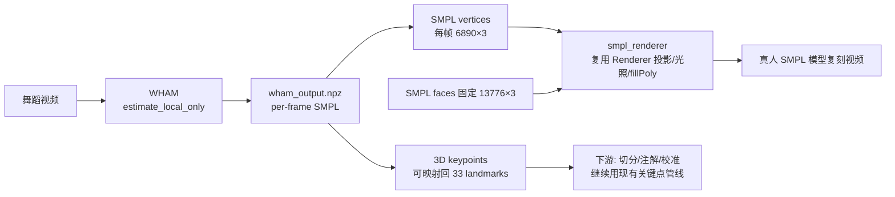

# WHAM / 4D-Humans 视频级 SMPL 重建引擎接入方案

> 架构师：高见远
> 目标：把 3D 人体重建引擎从 MediaPipe Pose 升级为视频级 SMPL 重建方案，追求「最好的动作还原效果」
> 硬件实测：NVIDIA GeForce RTX 4060 Laptop（8GB 显存，Ada Lovelace，sm_89），Windows（win32）
> 结论先行：**首选 WHAM（`--estimate_local_only` 跳过 SLAM），WSL2 + Ubuntu 22.04 + PyTorch 2.1 + cu118；SMPL mesh 直接渲染接入现有软件光栅化管线。**

---

## 一、结论速览（TL;DR）

| 决策项 | 结论 |
|--------|------|
| 技术选型 | **WHAM（yohanshin/WHAM）**，`--estimate_local_only` 模式（跳过 DPVO/SLAM）；备选 4D-Humans 的 HMR 2.0 单帧 |
| 运行环境 | **WSL2 + Ubuntu 22.04**（Windows 直接跑不可行）；Docker Desktop 为备选 |
| CUDA / PyTorch | **PyTorch 2.1.0 + cu118**（Ada sm_89 必须 ≥2.0 + cu117，绝不能用官方的 1.11+cu113） |
| 渲染对接 | **直接渲染 SMPL mesh**（复用现有 `Renderer` 软件光栅化，零重定向损失）；Mixamo 重定向为可选增强 |
| 关键风险 | ViTPose 依赖编译、8GB 显存边界、单视频耗时、WSL2 磁盘占用 |

---

## 二、技术选型对比

### 2.1 候选方案对比

| 维度 | WHAM | 4D-Humans（HMR 2.0） | MediaPipe Pose（现状） |
|------|------|----------------------|----------------------|
| 输出 | SMPL 参数（θ/β）+ 顶点 mesh（6890）+ world-grounded 全局轨迹 | SMPL 参数 + 顶点 mesh（逐帧）+ PHALP 跟踪 | 33 关键点（相对深度） |
| 时序一致性 | **强**（motion context 跨帧融合，CVPR 2024） | 弱（单帧 HMR 2.0 + 独立跟踪） | 弱（逐帧独立） |
| 动作还原精度 | **最高**（world-grounded、脚步接触约束、防滑步） | 高（HMR 2.0 单帧 SOTA） | 一般（相对 3D、抖动） |
| 依赖复杂度 | 高（DPVO + ViTPose + HMR2.0 权重） | 中高（detectron2 + PHALP） | 低（已跑通） |
| Windows 障碍 | DPVO（Linux 编译）→ 可跳过；ViTPose（mmcv 编译） | detectron2（Linux GCC12 编译）+ PHALP | 无 |
| 官方环境 | Ubuntu + Py3.9 + torch1.11 + CUDA11.3 | Ubuntu + Py3.10 + torch1.13 + CUDA11.6 | 任意 |
| SMPL 注册 | smpl + smplify 两处 | 仅 smpl（neutral） | 不需要 |

### 2.2 明确推荐：WHAM（`--estimate_local_only`）

**推荐理由：**

1. **效果最好**：WHAM 是 CVPR 2024 视频级方法，核心优势是**跨帧时序一致性**（motion context）+ **world-grounded 全局轨迹** + **接触感知脚步防滑**，这正是舞蹈动作还原最看重的三点（动作连贯不抖、脚步不漂移、还原真实）。4D-Humans 本质是"单帧 HMR 2.0 + 独立跟踪"，时序抖动需额外平滑，达不到 WHAM 的连贯性。
2. **可绕过最大障碍**：`--estimate_local_only` 跳过 SLAM（DPVO/DROID-SLAM），而 DPVO 是 Windows 上最难的编译依赖。舞蹈场景固定机位，不需要 SLAM 的相机轨迹，跳过无损。
3. **8GB 显存可行**：WHAM 推理为 ViT-B 编码 + 轻量 motion decoder，单视频逐帧推理 8GB 可跑（需 fp16 + 小 batch，见风险节）。

**备选（Plan B）：4D-Humans 的 HMR 2.0 单帧**——若 WHAM 的 ViTPose 依赖最终无法编译，退而求其次用 HMR 2.0 逐帧跑（效果仍优于 MediaPipe），再加时序平滑。检测器可用 ultralytics YOLOv8 替换 detectron2 以降低门槛。

**不推荐**：直接装 WHAM 官方 PyTorch 1.11 + CUDA 11.3（RTX 4060 sm_89 会报 `no kernel image is available`）。

---

## 三、环境方案（Windows + RTX 4060 Ada）

### 3.1 为什么必须 WSL2

WHAM 依赖 ViTPose（mmcv/mmpose）需编译 CUDA/CPU 扩展，4D-Humans 依赖 detectron2（需 Linux GCC12）。两者**官方均不支持原生 Windows**，Windows 直接编译成功率极低。故选择 **WSL2（Ubuntu 22.04）GPU 直通**。

### 3.2 CUDA 版本如何适配 Ada（sm_89）

RTX 4060 是 Ada Lovelace（compute capability 8.9 / sm_89）。NVIDIA 驱动（Windows 侧，`nvidia-smi` 已可见）决定了 WSL2 内可用的 CUDA 运行时上限（本机驱动支持 CUDA 12.x）。关键约束：

| 约束 | 说明 |
|------|------|
| 最低 PyTorch | **2.0.0 + cu117 及以上**（含 sm_89 kernel）；官方 WHAM 的 torch 1.11 + cu113 会直接 `no kernel image` |
| 推荐 PyTorch | **2.1.0 + cu118**：sm_89 支持稳妥，且 mmcv/mmpose/detectron2 生态 cu118 wheel 最全 |
| 备选 | 2.2.x + cu121（更新，但部分老依赖无 cu121 wheel） |

**结论：PyTorch 2.1.0 + cu118**。安装命令见第六章。

### 3.3 WSL2 安装要点

```powershell
# Windows 侧（PowerShell，管理员）
wsl --update                                   # 确保 WSL2 最新
wsl --install -d Ubuntu-22.04                  # 安装 Ubuntu 22.04
wsl --set-default-version 2
```

- WSL2 内 GPU 直通：**无需在 WSL2 内装 NVIDIA 驱动或 CUDA Toolkit**（Windows 侧驱动 528+ 即可），`nvidia-smi` 在 WSL2 内直接可见。
- 仅当需要 `nvcc` 编译（如 mmcv 从源码构建）时，才在 WSL2 内装 CUDA Toolkit 11.8；优先用预编译 wheel 避免编译。
- 建议 `wsl.conf` 限制内存（如 12GB）防止 vhdx 无界膨胀。

### 3.4 Docker Desktop（备选）

Docker Desktop（WSL2 backend）+ NVIDIA Container Toolkit 也可跑，但 WHAM 需要下载 SMPL（注册凭据）+ 编译 ViTPose，容器内调试更繁琐。**优先 WSL2 原生 conda 环境**。

---

## 四、SMPL 模型注册入口 + 下载步骤

### 4.1 注册入口（准确 URL）

| 模型 | 注册/登录 | 说明 |
|------|-----------|------|
| SMPL | **https://smpl.is.tue.mpg.de/** | 主模型；下载页 `https://smpl.is.tue.mpg.de/download.php` |
| SMPLify | **https://smplify.is.tue.mpg.de/** | WHAM 的 `fetch_demo_data.sh` 会同时要这两个账号密码 |
| MANO（可选） | https://mano.is.tue.mpg.de/ | WHAM 不强制 |

### 4.2 下载步骤

1. 打开 https://smpl.is.tue.mpg.de/ → 注册账号（邮箱验证）→ 登录 → 进入 **Downloads** 页。
2. 下载 **SMPL Python 版**，得到三个 pkl：
   - `basicModel_neutral_lbs_10_207_0_v1.0.0.pkl`（WHAM/4D-Humans 必需）
   - `basicModel_f_lbs_10_207_0_v1.0.0.pkl`（WHAM 需要）
   - `basicModel_m_lbs_10_207_0_v1.0.0.pkl`（WHAM 需要）
3. 打开 https://smplify.is.tue.mpg.de/ → 同样注册（WHAM `fetch_demo_data.sh` 需要账号密码，用于下载 SMPLify 相关辅助数据）。
4. 放置位置：
   - **WHAM**：运行 `bash fetch_demo_data.sh`，脚本会交互式要 SMPL + SMPLify 账号密码，自动下载到 `dataset/body_models/smpl/`。
   - **4D-Humans**：只需 `basicModel_neutral_lbs_10_207_0_v1.0.0.pkl` 放 `./data/`；视频跟踪还需复制到 `~/.cache/phalp/3D/models/smpl/SMPL_NEUTRAL.pkl`。

> ⚠️ SMPL 模型是 MPI 授权的研究用途模型，不可外传/商用；本软件第一版纯本地、游客使用，符合研究用途，但需在 README 标注。

---

## 五、与现有渲染管线的对接（重点）

### 5.1 现有渲染管线（已读代码，确认）

```
render_mannequin_video.py::Renderer.render_frame(kps_frame)
  └─ SkinAnimator.skin_frame_from_kps(kps_frame)   # 33关键点 → 17关节 → LBS 蒙皮
       └─ GLBModel（Mixamo 17 关节 + 蒙皮权重 + IBM）
  └─ 软件光栅化：投影(y旋转35°) → Blinn-Phong光照 → painter → cv2.fillPoly
```

**关键发现**：现有 `Renderer` 本质是一个**「任意 mesh 光栅化器」**——它只关心「蒙皮后顶点列表 + 三角形索引」，蒙皮只是顶点来源之一。因此 WHAM 的 SMPL mesh 可以**直接作为顶点来源**接入，无需改动渲染核心。

### 5.2 对接结论：直接渲染 SMPL mesh（首选）

**为什么直接渲 SMPL，而非重定向到 Mixamo：**

| 对比 | 直接渲 SMPL mesh（推荐） | SMPL 参数重定向到 Mixamo |
|------|--------------------------|--------------------------|
| 动作还原 | **零损失**（WHAM 顶点即最终形态） | 二次重定向损失（SMPL 24 关节→Mixamo 17 关节有信息损失） |
| 实现成本 | 低（新增一个「外部顶点渲染」入口） | 高（需 SMPL→Mixamo 关节映射 + β 体型适配 + 朝向对齐） |
| 外观 | SMPL 裸模（无纹理/衣服） | Mixamo 模型（有衣服/纹理） |
| 契合「最好还原」目标 | ✅ 完全契合 | ❌ 有损失 |

**推荐：路线 A（直接渲 SMPL mesh）作为主路径**；路线 B（SMPL→Mixamo 重定向）作为「想要衣服外观」的可选增强，第二版再做。

### 5.3 对接实现（路线 A：直接渲 SMPL mesh）



**具体代码改动点（新增 2 个文件，改动 1 个文件）：**

1. **新增 `backend/app/pipeline/smpl_loader.py`**：
   - 从 WHAM 输出（`.npz`/`.pkl`）读取 per-frame `verts`（`[T, 6890, 3]`）。
   - 从 SMPL pkl 提取 `faces`（固定 `[13776, 3]`，只读一次存本地 `data/smpl_faces.npy`）。
   - 可选：用 SMPL joint regressor 把 24 关节 → 投影到 2D，桥接回 33 landmark 格式（供下游切分/校准复用，因为切分已是「节拍为主」，关键点仅做能量峰辅助）。

2. **新增 `backend/app/pipeline/smpl_renderer.py`**（或扩展 `render_mannequin_video.py` 的 `Renderer`）：
   - 复用 `Renderer` 的 `_fit_view`（用 SMPL rest/首帧顶点算视口缩放居中）、投影、Blinn-Phong、painter、`cv2.fillPoly`。
   - 新增方法 `render_vertices(vertices: np.ndarray, faces: np.ndarray) -> np.ndarray`，直接吃外部顶点 + 面索引。
   - **坐标系转换**：SMPL 为 y-up 米制坐标，现有渲染是屏幕 y-down；需 y 翻转 + 居中缩放（`_fit_view` 已含缩放，只需加 y 翻转与单位归一）。

3. **改动 `backend/app/pipeline/pipeline.py`（编排器）**：
   - 新增分支 `engine = "wham"`：处理时调 WHAM 产出 SMPL 顶点序列 + 桥接关键点，渲染走 `smpl_renderer`。
   - 保留 `engine = "mediapipe"` 分支（现有 Mixamo 路径）做 A/B 对照与回退。

### 5.4 下游环节（切分/注解/校准）如何继续工作

- **切分**：已是「librosa 节拍为主 + 能量峰辅助」，节拍不依赖关键点精度；能量峰辅助可改用 WHAM 的 3D 关节速度（更准）。
- **注解**：模板 + 规则，不受影响。
- **校准 UI**：前端在关键帧上拖关节修正——可桥接 WHAM 的 3D keypoints 到 33 landmark 格式，复用现有校准交互；或对 SMPL 关键帧做顶点/关节修正（第二版）。

---

## 六、分步骤可执行计划

### 6.1 依赖清单

| 项 | 内容 | 大小估算 |
|----|------|----------|
| WSL2 Ubuntu 22.04 | 基础系统 | ~5GB vhdx |
| Miniconda | 环境管理 | ~500MB |
| PyTorch 2.1.0 + cu118 + torchvision | GPU 推理 | ~2.5GB |
| WHAM 仓库 + 子模块 | 代码 + ViTPose | ~1GB |
| WHAM checkpoints | wham_vit_w_3dpw / vitpose / hmr2a / yolov8x | ~4GB |
| SMPL 模型 ×3 + SMPLify | 需注册 | ~100MB |
| 现有后端依赖 | 不变（`backend/requirements.txt`） | — |

### 6.2 关键命令（按顺序）

```bash
# ========== 0. Windows 侧 ==========
wsl --update
wsl --install -d Ubuntu-22.04

# ========== 1. WSL2 内：环境 + PyTorch（Ada 关键） ==========
# 验证 GPU 直通
nvidia-smi                      # 应显示 RTX 4060 / CUDA 12.x

# 安装 Miniconda + 建环境
conda create -n wham python=3.9 -y
conda activate wham

# ★ 核心：Ada(sm_89) 必须用 torch>=2.0 + cu117/cu118，覆盖官方 1.11
pip install torch==2.1.0 torchvision==0.16.0 --index-url https://download.pytorch.org/whl/cu118

# 验证 sm_89 kernel 存在
python -c "import torch; print(torch.cuda.is_available()); print(torch.cuda.get_device_name(0)); print(torch.cuda.get_arch_list())"
# 期望：True / NVIDIA GeForce RTX 4060 Laptop GPU / 列表含 'sm_89' 或 '+PTX'

# ========== 2. 拉取 WHAM ==========
git clone https://github.com/yohanshin/WHAM.git --recursive
cd WHAM
pip install -r requirements.txt        # 注意：可能把 torch 覆盖回 1.11，装完重装 torch 2.1
pip install torch==2.1.0 torchvision==0.16.0 --index-url https://download.pytorch.org/whl/cu118

# 装 ViTPose 依赖（mmcv/mmpose；优先预编译 wheel，避免源码编译）
pip install mmcv-full==1.7.1 -f https://download.openmmlab.com/mmcv/dist/cu118/torch2.1/index.html
pip install mmpose==0.29.0

# ========== 3. 下载 SMPL + checkpoints（需注册） ==========
bash fetch_demo_data.sh               # 交互式输入 SMPL + SMPLify 账号密码

# ========== 4. 跑通 demo（跳过 SLAM） ==========
python demo.py --video /path/to/dance.mp4 --estimate_local_only --visualize
# 输出：results 目录含 per-frame SMPL（pose/betas/verts/keypoints_3d）
```

### 6.3 验证标准（每步 Gate）

| 步骤 | 验证标准 |
|------|----------|
| 环境 | `torch.cuda.is_available()==True` 且 `get_arch_list()` 含 `sm_89`/`+PTX` |
| SMPL | `dataset/body_models/smpl/` 下 3 个 pkl 存在 |
| WHAM demo | `python demo.py --estimate_local_only --visualize` 产出可视化 mp4 + SMPL 结果，无 CUDA 报错 |
| 渲染对接 | `smpl_renderer.render_vertices()` 对单帧输出正确侧角人体图像（与现有 mannequin 渲染同风格） |
| 端到端 | 一条舞蹈视频 → WHAM SMPL 顶点序列 → 渲染 mp4，动作连贯、脚步不滑 |

---

## 七、待明确事项 + 风险

### 7.1 风险与缓解

| 风险 | 等级 | 说明 | 缓解 |
|------|------|------|------|
| **ViTPose 依赖编译失败** | 高 | mmcv/mmpose 在 WSL2 + torch2.1 上可能无匹配 wheel | 用官方 cu118/torch2.1 索引的 mmcv wheel；不行则退 Plan B（HMR 2.0 + YOLOv8） |
| **8GB 显存边界** | 中 | WHAM（ViT-B + motion encoder）+ ViTPose 同进程可能接近 8GB | fp16 推理、`estimate_local_only`、逐帧/小 batch、必要时 30fps→15fps 抽帧跑 WHAM 再插值 |
| **单视频耗时** | 中高 | 30fps × 数分钟 ≈ 数千帧，ViT 逐帧推理慢，粗估 30~60 分钟/分钟视频 | 抽帧降 fps、`--estimate_local_only` 跳过 SLAM、GPU fp16；先做耗时基准测试 |
| **WSL2 磁盘/内存膨胀** | 中 | vhdx 随依赖/中间产物膨胀，默认吃一半内存 | `wsl.conf` 限制内存、SMPL 中间结果写到 Windows 侧 `/mnt/d/...` |
| **PyTorch 版本被 requirements 覆盖** | 低 | WHAM requirements.txt pin torch 1.11 | 装完依赖后强制重装 torch 2.1 并验证 sm_89 |
| **SMPL 授权合规** | 低 | SMPL 为 MPI 研究用途模型 | 纯本地、不商用、README 标注；如商业化需换 Meshcapade 商业许可 |

### 7.2 待明确事项

1. **单视频耗时预算**：用户能接受"几分钟视频跑 30~60 分钟"吗？还是需要实时/准实时？（决定是否要抽帧降 fps 或换轻量方案）
2. **外观优先级**：能否接受 SMPL 裸模（无衣服）？若必须要有衣服外观，需走「SMPL→Mixamo 重定向」路线 B，成本显著增加。
3. **多人场景**：本方案按「单人」设计（此前已确认）；若未来要多人需 PHALP 跟踪，另评估。
4. **磁盘空间**：WSL2 + WHAM 依赖 + checkpoints 约 15GB，本机磁盘是否够（建议 ≥30GB 富余）。
5. **内存**：本机物理内存多少？（WSL2 建议 ≥16GB，ViT 推理 + mmcv 较吃内存）
6. **是否保留 MediaPipe 路径**：建议保留（A/B 对照 + 回退），还是彻底切换？

---

*（全文完）*
